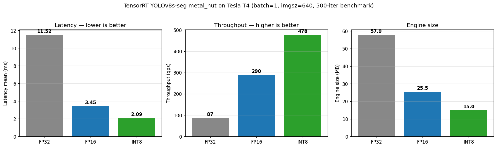

# aoi-deepstream-tensorrt

> **Status**: 🚧 Active development — 2-week sprint started 2026-05-05. README is updated daily; results land progressively.

End-to-end Automated Optical Inspection (AOI) defect detection MVP on the NVIDIA inference stack: **PyTorch → ONNX → TensorRT → DeepStream**. Built to validate latency, throughput, and image-quality robustness for industrial inspection workloads.

## Project Management

- **[GitHub Project Board](https://github.com/users/hsuani/projects/1)** — Epics, Stories, Sprint tracking
- [Project Charter](docs/project-charter.md) — goal, scope, timeline
- [Risk Register](docs/risk-register.md) — open / mitigated / accepted risks
- [Architecture Decision Records](docs/adr/) — 5 ADRs covering model choice, calibration, precision selection
- [Day-by-day notes](notes/) — daily logs, retros, hyperparameter ablation

## Why this project

Smartphone ISP work taught me one thing the AOI literature undersells: **detection accuracy is upstream-bounded by sensor and pipeline image quality**. A model that hits 99% AUC on clean MVTec data can collapse under realistic factory conditions — exposure drift, sensor noise, alignment jitter — which the standard benchmarks ignore.

This repo benchmarks an AOI pipeline twice: once on the canonical MVTec AD test set, and once under ISP-style perturbations that mimic real production-line variance. The delta is the story.

## Architecture

```
                  +-------------------+        +------------------+
   MVTec AD --->  |  PyTorch training |  --->  |  ONNX (opset 17) |
                  |  (YOLOv8-seg +    |        +------------------+
                  |   EfficientAD)    |                 |
                  +-------------------+                 v
                                              +------------------+
                                              | TensorRT engine  |
                                              | FP32 / FP16 /    |
                                              | INT8 (entropy)   |
                                              +------------------+
                                                       |
                                                       v
            +-------------------------------------------------------------+
            |  DeepStream 7.x pipeline (Python)                           |
            |  uridecodebin -> nvstreammux -> nvinfer -> nvdsosd -> sink  |
            +-------------------------------------------------------------+
                                                       |
                                                       v
                                          Annotated mock factory stream
```

## Stack

| Layer | Tool |
|---|---|
| Training | PyTorch · Ultralytics YOLOv8 · EfficientAD |
| Export | ONNX (opset 17, dynamic batch) |
| Optimization | TensorRT 10.x · `trtexec` · entropy calibration |
| Streaming | DeepStream 7.x · GStreamer · `nvinfer` · `nvdsosd` |
| Dataset | MVTec AD (transistor, cable, metal_nut) |
| Hardware | Mac M5 (MPS) for training · NVIDIA Tesla T4 (Kaggle) for TRT benchmark · A10 / L40S targets for production · CUDA 12.x |

## Results

### Latency / Throughput — TensorRT (NVIDIA Tesla T4, batch=1, imgsz=640)

| Precision | Engine size | Build time | Latency mean | Throughput | Speedup |
|-----------|-------------|------------|--------------|------------|---------|
| FP32      | 58.0 MB     | 57 s       | 10.91 ms     | 91.6 qps   | 1.00×   |
| FP16      | 25.3 MB     | 319 s      | 3.49 ms      | 286.5 qps  | **3.13×** |
| INT8      | 15.7 MB     | 480 s      | **2.09 ms**  | **478.1 qps** | **5.22×** |



INT8 calibration with `IInt8EntropyCalibrator2` over 335 MVTec metal_nut images.
Functional output drift: FP16 < 0.001% vs FP32, INT8 8.6%. Per-precision mAP
on val set deferred to production hardware verification.

Full benchmark methodology + reproducibility: [`benchmarks/trt-t4.md`](benchmarks/trt-t4.md).

### ISP-aware Robustness Study _(planned, week 2)_

Re-benchmark on perturbed test set:
- Sensor noise (Gaussian + Poisson, three intensities)
- Exposure drift (±2 EV)
- Alignment jitter (rotation ±3°, translation ±5 px)

Hypothesis: INT8 quantization amplifies sensitivity to low-SNR inputs. To be measured.

## Repo layout

```
.
├── src/
│   ├── data/
│   │   ├── mvtec_to_yolo.py          # MVTec → YOLOv8-seg format converter
│   │   └── visualize_yolo_label.py   # polygon overlay sanity check
│   ├── train.py                      # YOLOv8s-seg fine-tune entry (recipe v1/v2/v3)
│   ├── export_onnx.py                # ONNX export with onnxruntime verification
│   ├── deepstream/                   # gst pipeline + config (D5-D7, in progress)
│   └── isp_aug/                      # ISP-aware augmentation (D8-D9, planned)
├── notebooks/
│   └── aoi-tensorrt-benchmark.ipynb  # Kaggle T4 FP32/FP16/INT8 build + benchmark
├── benchmarks/
│   └── trt-t4.md                     # Tesla T4 benchmark methodology + results
├── engines/
│   └── metal_nut_int8.cache          # entropy calibration cache (reproducible re-build)
├── notes/                            # day-by-day logs, retros, hyperparameter ablation
└── docs/
    ├── adr/                          # 5 architecture decision records
    ├── project-charter.md
    ├── risk-register.md
    └── trt_benchmark_t4.png          # latency / throughput / size bar plot
```

## Running

### 1. Train baseline (Mac MPS or NVIDIA GPU)

```bash
git clone git@github.com:hsuani/aoi-deepstream-tensorrt.git
cd aoi-deepstream-tensorrt
python3.12 -m venv .venv && source .venv/bin/activate
pip install -r requirements.txt

# Convert MVTec → YOLO format (download MVTec AD first; see notes/day-02-training_summary.md)
python src/data/mvtec_to_yolo.py --src data/mvtec --dst data/yolo

# Train metal_nut (recipe v1: lr=auto, full augmentation, ~30 min on M5 / T4)
python src/train.py --class metal_nut --epochs 50 --recipe v1
```

### 2. Export ONNX

```bash
python src/export_onnx.py \
  --weights runs/segment/metal_nut_v1/weights/best.pt \
  --imgsz 640 --dynamic --simplify
```

### 3. Build TRT engines + benchmark (Kaggle T4)

Open [`notebooks/aoi-tensorrt-benchmark.ipynb`](notebooks/aoi-tensorrt-benchmark.ipynb)
on a Kaggle notebook with T4 GPU + Internet enabled. Upload the ONNX as a Kaggle
Dataset and the calibration data (MVTec metal_nut subset). Run cells top-to-bottom
(~30 min total: FP32 1m + FP16 5m + INT8 8m + benchmarks).

### 4. DeepStream pipeline _(D5-D7, in progress)_

Pending NVIDIA LaunchPad lab approval; instructions land when the pipeline is committed.

## Roadmap

- [x] **D1** — Repo skeleton, MVTec → YOLO converter, dev environment
- [x] **D2** — MVTec AD baseline (3 classes; metal_nut mAP@50 0.75; transistor / cable cross-class study)
- [x] **D3** — ONNX export with dynamic batch + onnxruntime verification
- [x] **D4** — TensorRT FP32 / FP16 / INT8 build + benchmark on Tesla T4 (5.22× INT8 speedup)
- [x] **D5** — GCP L4 VM + NGC DeepStream 9.0 environment (driver 590, Ubuntu 24.04, NV stack alive)
- [x] **D6** — `deepstream-byovm` skill autonomous mode generated end-to-end pipeline scaffolding (det-only path per ADR-0006)
- [ ] **D7** — Pipeline run on L4 → multi-stream PDF benchmark report → 30-sec demo video; optional Path B custom seg parser stretch
- [ ] **D8-D9** — ISP-aware augmentation robustness study per precision
- [ ] **D10-D14** — Documentation polish, blog post, NVIDIA Inception application
- [ ] _Stretch_ — EfficientAD secondary baseline; Jetson Orin Nano deployment

## Limitations & honest caveats

- 2-week scope: 3 MVTec classes, single-stream DeepStream config. Multi-stream + multi-model orchestration is future work.
- INT8 calibration uses MVTec train split; production deployment would require calibration on representative line data.
- ISP-aware augmentation is parametric, not derived from real factory captures.

## Author

Yu-Hsuan (Shane) Tseng — ex-Qualcomm ISP/Camera, building toward NVIDIA Metropolis (Manufacturing). Prior experience: smartphone ISP tuning, MediaPipe geometric analysis, serverless ML deployment.

## License

MIT
