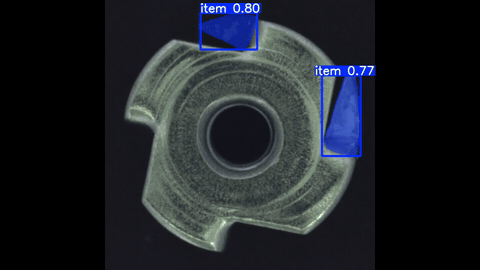
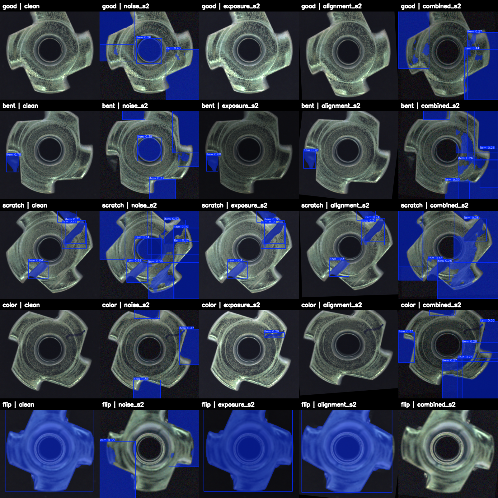

# aoi-deepstream-tensorrt

> **Status**: 🚧 Active development — 2-week sprint started 2026-05-05. README is updated daily; results land progressively.

End-to-end Automated Optical Inspection (AOI) defect detection MVP on the NVIDIA inference stack: **PyTorch → ONNX → TensorRT → DeepStream**. Built to validate latency, throughput, and image-quality robustness for industrial inspection workloads.

## Project Management

- **[GitHub Project Board](https://github.com/users/hsuani/projects/1)** — Epics, Stories, Sprint tracking
- [Project Charter](docs/project-charter.md) — goal, scope, timeline
- [Sprint Narrative](docs/sprint-narrative.md) — full D1-D14 walkthrough: sub-items, figures, issues + workarounds, results, discussion, extensions
- [Sprint Checklists](docs/checklists/) — frozen per-stage plan: [stage-1](docs/checklists/stage-1.md) · [stage-2](docs/checklists/stage-2.md) · [stage-3](docs/checklists/stage-3.md) · [stage-4](docs/checklists/stage-4.md)
- [Risk Register](docs/risk-register.md) — open / mitigated / accepted risks
- [Architecture Decision Records](docs/adr/) — 7 ADRs covering model choice, calibration, precision selection, deployment scope, ISP-aware hypotheses
- [Day-by-day notes](notes/) — daily logs (D2 / D4 / D5 / D6 / D7 / D8 / D9), retros, hyperparameter ablation

## Why this project

Smartphone ISP work taught me one thing the AOI literature undersells: **detection accuracy is upstream-bounded by sensor and pipeline image quality**. A model that hits 99% AUC on clean MVTec data can collapse under realistic factory conditions — exposure drift, sensor noise, alignment jitter — which the standard benchmarks ignore.

This repo benchmarks an AOI pipeline twice: once on the canonical MVTec AD test set, and once under ISP-style perturbations that mimic real production-line variance. The delta is the story.

## Architecture

PNG: [`docs/architecture.png`](docs/architecture.png) (source: [`docs/architecture.dot`](docs/architecture.dot))

```
                  +-------------------+        +-------------------+
   MVTec AD --->  |  PyTorch training |  --->  |  ONNX (opset 17)  |
       |          |  (YOLOv8s-seg)    |        +-------------------+
       |          +-------------------+                  |
       |                                                 v
       |  val split                             +-------------------+
       |  (49 imgs, 4 defect types)             | TensorRT engine   |
       |                                        | FP32 / FP16 /     |
       v                                        | INT8 (entropy)    |
+----------------------+                        +-------------------+
| ISP-aware aug (D8)   |                                 |
|  - noise   (Poi+G)   |                +----------------+----------------+
|  - exposure (EV+WB+γ)|                v                                 v
|  - alignment (R+T+S) |    +-----------------------+      +-----------------------+
+----------------------+    | DeepStream 9.0        |      | onnxruntime / val.py  |
       |                    | uridecodebin →        |      | per-precision mAP     |
       v                    | nvstreammux →         |      | (× 13 perturbed cells)|
+----------------------+    | nvinfer → nvdsosd →   |      +-----------------------+
| 13 perturbed val     |    | sink                  |                  |
| cells (3×3 + 3 comb) |    +-----------------------+                  v
+----------------------+              |                       +-----------------------+
       |                              v                       | Robustness matrix     |
       +----------------------+ Annotated mock                | mAP@50, per-defect    |
                                factory stream                +-----------------------+
                                (L4 INT8, 465 img/s)
```

Top-down: training → deploy (right branch, D5-D7). val branch (left, D8-D9) feeds
the same `.pt` model into the ISP-aware perturbation pipeline → robustness eval.
Same model weights, two inference paths; bridge is `src/isp_aug/` (D8 module).

## Stack

| Layer | Tool |
|---|---|
| Training | PyTorch · Ultralytics YOLOv8 · EfficientAD |
| Export | ONNX (opset 17, dynamic batch) |
| Optimization | TensorRT 10.x (10.14 in DS 9.0 container) · `trtexec` · entropy calibration |
| Streaming | DeepStream 9.0 · `pyservicemaker` · GStreamer · `nvinfer` · `nvdsosd` |
| Dataset | MVTec AD (transistor, cable, metal_nut) |
| Hardware | Mac M5 (MPS) for training · Tesla T4 (Kaggle) for TRT bench · L4 (GCP) for DeepStream pipeline · A10 / L40S as production targets · CUDA 12.x (Kaggle) / 13.1 (DS 9.0 container) |

## Results

### Live Demo



> 28-sec clip showing per-frame defect detection on 115 MVTec metal_nut test
> images. Generated locally on Mac (Ultralytics + MPS backend) for portfolio
> embedding; production DeepStream pipeline (D7) produces visually equivalent
> overlays at sub-2 ms latency on NVIDIA L4 GPU (see DeepStream Multi-Stream
> table below).
> [Full HD mp4](docs/deepstream_demo.mp4).

### Latency / Throughput — TensorRT (NVIDIA Tesla T4, batch=1, imgsz=640)

| Precision | Engine size | Build time | Latency mean | Throughput | Speedup |
|-----------|-------------|------------|--------------|------------|---------|
| FP32      | 58.0 MB     | 57 s       | 10.91 ms     | 91.6 qps   | 1.00×   |
| FP16      | 25.3 MB     | 319 s      | 3.49 ms      | 286.5 qps  | **3.13×** |
| INT8      | 15.7 MB     | 480 s      | **2.09 ms**  | **478.1 qps** | **5.22×** |


INT8 calibration with `IInt8EntropyCalibrator2` over 335 MVTec metal_nut images.
Functional output drift: FP16 < 0.001% vs FP32, INT8 8.6%. Per-precision mAP
on val set deferred to production hardware verification.

Full benchmark methodology + reproducibility: [`benchmarks/trt-t4.md`](benchmarks/trt-t4.md).

### DeepStream Multi-Stream — NVIDIA L4 GPU (GCP), DS 9.0, INT8, batch=4

| Run | fps / stream | total img/s | RT @ 30 fps/stream |
|-----|--------------|-------------|---------------------|
| 1   | 116.17       | 464.68      | ✅ 3.8× headroom    |
| 2   | 116.43       | 465.72      | ✅                  |

L4 vs T4 (D4): INT8 BS=1 throughput 478 → 540 qps (~1.13× speedup).
DeepStream pipeline overhead absorbs ~57% of raw `trtexec` throughput (808 → 465
img/s) — within typical DS production envelope (decode + memcpy + nvinfer + osd
+ sink). KITTI dump confirms parser correctness with 9 876 metal_nut defect
detections across the 4-stream run.

Skill-orchestrated via NVIDIA `deepstream-byovm` agentic skill (det-only path
per [ADR-0006](docs/adr/0006-detection-only-deployment.md)).

Full PDF report: [`benchmark_report.pdf`](src/deepstream/models/yolov8s_seg_metal_nut/reports/benchmark_report_yolov8s_seg_metal_nut.pdf).

### ISP-aware Robustness Study (D8)

Three perturbation modules ([`src/isp_aug/`](src/isp_aug/)) calibrated for
production-line spectrum, all linear-domain physics (de-gamma → perturb →
re-gamma):

- **noise**: Poisson shot + Gaussian read + ISO/gain push + Bayer-pattern asymmetry
- **exposure**: linear gain + WB drift (per-100K R/B asymmetry) + gamma offset
- **alignment**: rotation + translation + anisotropic scale (single affine)

13-cell mAP@50 (mask) matrix, baseline = 0.7502:

| Perturbation | s1 | s2 | s3 |
|---|---|---|---|
| noise | 0.034 (-95%) | 0.030 | 0.001 (-99.8%) |
| exposure | 0.741 (-1%) | 0.749 | 0.733 (-2%) |
| alignment | 0.698 (-7%) | 0.309 | 0.126 (-83%) |
| combined | 0.018 | 0.005 | 0.000 |

**Empirical sensitivity ranking**: NOISE >>> ALIGNMENT > EXPOSURE
(predicted in [ADR-0007](docs/adr/0007-isp-aware-perturbation-hypotheses.md) was
NOISE > EXPOSURE > ALIGNMENT — partially wrong, exposure/alignment swapped).

**Hypothesis verdicts** (pre-stated in ADR-0007 before any eval ran):

| # | Hypothesis | Verdict |
|---|---|---|
| H1 | NOISE > EXPOSURE > ALIGNMENT | **PARTIALLY WRONG** — direction kept on NOISE first; exposure / alignment swapped; magnitude wildly underestimated |
| H2 | INT8 compounds noise disproportionately vs FP16 | **DEFERRED** — Mac M5 has no TRT path; cross-precision eval needs L4 re-deploy |
| H3 | Mild alignment within training-aug envelope (< 5% drop) | **CORRECT (within tolerance)** — 7.0% drop, just above predicted bound |
| H4 | Combined-apply super-linear vs sum-of-individuals | **INCONCLUSIVE** — masked by noise dominance |

**Top finding**: production-line normal noise (SNR 30-40 dB) collapses mAP
from 0.75 → 0.03 (-95%). Training had zero sensor-noise augmentation →
any noise input is fully OOD. Mitigation path: integrate `noise.apply()`
(same Poisson + Gaussian linear-domain model used for D4 INT8 calibration)
as a training-time augmentation transform — calibration cache and training
noise model share one physics, bridging quantization design with
deployment robustness.

**Engineering implications**:

1. **Noise augmentation MUST be added to training** — the single biggest
   gap; without it the model is not deployment-ready. Cheap fix:
   `albumentations.GaussNoise`. Proper fix (NV-flavored): integrate the
   same physical noise model used for INT8 calibration as a training
   transform — shared physics across calibration and training.
2. **HSV-domain training augmentation is over-sufficient for exposure**
   — `hsv_v=0.4` + mosaic scale variance absorbs ±2 EV + WB drift with
   only ~2% mAP loss. Industrial AOI does not need elaborate
   exposure-domain compensation pipelines if HSV jitter is generous.
3. **Alignment surprise risk: combined > sum-of-axes** — single-axis
   rotation up to ±10° is covered by training (`degrees=10`). But
   *combined* rotation + translation + anisotropic scale at s2 (each
   axis within training range alone) breaks the model (-59%). Stacked
   fixture drifts in production can fail an otherwise robust pipeline.
4. **Noise dominates "compound effect" engineering** — without
   noise-augmented training, sensor noise is the rate-limiting factor.
   "First OOD axis" engineering matters more than "compound effect"
   engineering in this regime.

**Visual proof**:
- 

  5 sample images × 5 cells at moderate severity. Clean detects defects
  cleanly; noise / combined produce "blue-blob" oversized masks; exposure
  preserves detection; alignment partial.

- [Severity progression on `scratch_007`](docs/robustness_grid_severity.png)
  shows per-perturbation degradation across s1/s2/s3.

**Per-defect insights** (52 sub-evals, [`benchmarks/robustness_per_defect.csv`](benchmarks/robustness_per_defect.csv)):

- `flip` is **alignment-invariant** (mAP 0.995 across all alignment
  severities) — model learned rotation-equivariant features for the
  orientation-anomaly defect class.
- `color` baseline is the bottleneck (0.396), but **slightly improves**
  under moderate/severe exposure (gain push enhances tonal contrast, the
  dominant cue for color defects).
- `scratch + noise` is the most fragile pairing (0.712 → 0.128 at noise_s1)
  — high-frequency cue drowns in additive noise first.
- `bent` has an alignment cliff at s2 (0.995 → 0.095) — combined rotation
  + translation + scale disrupts the edge-angle cue without entering
  training-aug range alone.

**Honest caveats** (full discussion in [`benchmarks/robustness.md`](benchmarks/robustness.md) §4):
single precision only (FP32 PyTorch on Mac; H2 unverified); ground-truth
polygons not transformed under alignment (matches deployment scenario but
conflates model-robustness with label-image misalignment); single seed per
cell (±1-3% mAP variance expected on reseed).

Full methodology + analysis: [`benchmarks/robustness.md`](benchmarks/robustness.md) ·
execution log + outstanding D9 items: [`notes/day-09.md`](notes/day-09.md).

## Repo layout

```
.
├── src/
│   ├── data/
│   │   ├── mvtec_to_yolo.py          # MVTec → YOLOv8-seg format converter
│   │   └── visualize_yolo_label.py   # polygon overlay sanity check
│   ├── train.py                      # YOLOv8s-seg fine-tune entry (recipe v1/v2/v3)
│   ├── export_onnx.py                # ONNX export with onnxruntime verification
│   ├── deepstream/
│   │   └── models/yolov8s_seg_metal_nut/   # skill bundle: parser .cpp + Dockerfile + scripts + reports + bench logs
│   └── isp_aug/                      # ISP-aware augmentation (D8-D9, planned)
├── notebooks/
│   └── aoi-tensorrt-benchmark.ipynb  # Kaggle T4 FP32/FP16/INT8 build + benchmark
├── benchmarks/
│   └── trt-t4.md                     # Tesla T4 benchmark methodology + results
├── engines/
│   └── metal_nut_int8.cache          # entropy calibration cache (reproducible re-build)
├── notes/                            # day-by-day logs, retros, hyperparameter ablation
└── docs/
    ├── adr/                          # 6 architecture decision records (incl. ADR-0006 det-only deployment)
    ├── project-charter.md
    ├── risk-register.md
    └── trt_benchmark_t4.png          # latency / throughput / size bar plot
```

## Running

### 1. Train baseline (Mac MPS or NVIDIA GPU)

```bash
git clone git@github.com:hsuani/aoi-deepstream-tensorrt.git
cd aoi-deepstream-tensorrt
python3.12 -m venv .venv && source .venv/bin/activate
pip install -r requirements.txt

# Convert MVTec → YOLO format (download MVTec AD first; see notes/day-02-training_summary.md)
python src/data/mvtec_to_yolo.py --src data/mvtec --dst data/yolo

# Train metal_nut (recipe v1: lr=auto, full augmentation, ~30 min on M5 / T4)
python src/train.py --class metal_nut --epochs 50 --recipe v1
```

### 2. Export ONNX

```bash
python src/export_onnx.py \
  --weights runs/segment/metal_nut_v1/weights/best.pt \
  --imgsz 640 --dynamic --simplify
```

### 3. Build TRT engines + benchmark (Kaggle T4)

Open [`notebooks/aoi-tensorrt-benchmark.ipynb`](notebooks/aoi-tensorrt-benchmark.ipynb)
on a Kaggle notebook with T4 GPU + Internet enabled. Upload the ONNX as a Kaggle
Dataset and the calibration data (MVTec metal_nut subset). Run cells top-to-bottom
(~30 min total: FP32 1m + FP16 5m + INT8 8m + benchmarks).

### 4. DeepStream 9.0 multi-stream pipeline (NVIDIA L4 GPU)

```bash
# scp ONNX + calibration cache + scripts to GPU host (e.g. GCP L4 VM)
gcloud compute scp --recurse --zone us-central1-a \
  src/deepstream/models/yolov8s_seg_metal_nut \
  <vm>:~/ds-metal-nut

# On GPU host:
cd ~/ds-metal-nut
docker build -t aoi-metal-nut:ds9 -f docker/Dockerfile .
docker run --rm --gpus all \
  -v "$PWD/model":/app/model \
  -v "$PWD/benchmarks":/app/benchmarks \
  -v "$PWD/samples":/app/samples \
  -v "$PWD/sources":/app/sources \
  -v "$PWD/reports":/app/reports \
  -v ~/mvtec/metal_nut/test:/data/mvtec/metal_nut/test:ro \
  aoi-metal-nut:ds9 all
```

Mac-side ffmpeg used to pre-generate 4 × 120 s test loop mp4 (DS 9.0 samples-multiarch
container lacks `x264enc` / `openh264enc` / `/dev/v4l2-nvenc`).

Skill-orchestrated via NVIDIA `deepstream-byovm` agentic skill (det-only, ADR-0006).

## Roadmap

Two-week sprint, four stages. Each stage has a frozen plan in
[`docs/checklists/`](docs/checklists/) and an annotated deep-dive in
[`docs/sprint-narrative.md`](docs/sprint-narrative.md).

Legend: ✅ done · 🟡 partial / deferred · ⏳ pending · ➖ dropped

### Stage 1 — D1-D4: Repo + Baseline + TRT Engines ✅

Resume submission unlocked from D1 onwards. Plan: [stage-1](docs/checklists/stage-1.md) · narrative: [Stage 1](docs/sprint-narrative.md#stage-1--d1-d4-repo-visible--baseline)

- ✅ **D1** — Repo skeleton + LICENSE (MIT) + `.gitignore`
- ✅ **D2** — MVTec AD 3-class baseline (transistor / cable / metal_nut); metal_nut mAP@50(M) **0.75**; cross-class study + 3-recipe ablation
- ✅ **D3** — ONNX export (opset 17, dynamic batch) + `onnx.checker` + onnxruntime sanity
- ✅ **D4** — TRT FP32 / FP16 / INT8 on Kaggle T4; entropy calibration (335 imgs); INT8 **5.22×** speedup (10.91 → 2.09 ms); functional drift FP16 < 0.001%, INT8 8.62%
- ➖ EfficientAD secondary baseline → stretch (see Extensions)

### Stage 2 — D5-D7: DeepStream Pipeline + Demo ✅

Plan: [stage-2](docs/checklists/stage-2.md) · narrative: [Stage 2](docs/sprint-narrative.md#stage-2--d5-d7-deepstream-pipeline--demo)

- ✅ **D5** — GCP L4 VM (g2-standard-8, Spot, driver 590, Ubuntu 24.04); DS 9.0 `samples-multiarch` container alive
- ✅ **D6** — `deepstream-byovm` skill autonomous mode generates end-to-end pipeline; det-only path per [ADR-0006](docs/adr/0006-detection-only-deployment.md); custom nvinfer bbox parser
- ✅ **D7** — Multi-stream bench (4 streams × 116 fps = **465 img/s aggregate** INT8) + KITTI dump parser correctness (9876 dets) + 28-sec demo video + PDF benchmark report; L4 vs T4 INT8 BS=1: 478 → 540 qps (1.13×)

### Stage 3 — D8-D10: ISP-aware Robustness + Polish 🟡

Plan: [stage-3](docs/checklists/stage-3.md) · narrative: [Stage 3](docs/sprint-narrative.md#stage-3--d8-d10-isp-aware-differentiation--polish)

- ✅ **D8** — 3 perturbation modules (noise · exposure · alignment, linear-domain physics) + combined-apply + CLI + 12 perturbed val cells; tune round 1 maps s1 to production-line normal (SNR 30-40 dB); [ADR-0007](docs/adr/0007-isp-aware-perturbation-hypotheses.md) hypotheses captured pre-eval
- 🟡 **D9** — 13-cell mAP matrix + per-defect breakdown (52 sub-evals) + hypothesis verdicts (H1 partially wrong, H3 correct, H2 deferred, H4 inconclusive); details: [day-09.md](notes/day-09.md). **Outstanding**: cross-precision FP32/FP16/INT8 matrix on L4 (O1), aggregated heatmap PNG (O2), label-transform-aware cells (O3), noise-augmented retrain (O4)
- 🟡 **D10** — README v2 + architecture diagram + ADR-0007 ✅; type hints / docstring / Makefile / pinned requirements / CI ⏳

### Stage 4 — D11-D14: Marketing + Submit ⏳

Plan: [stage-4](docs/checklists/stage-4.md) · narrative: [Stage 4](docs/sprint-narrative.md#stage-4--d11-d14-marketing--submit-)

- ⏳ **D11** — Blog draft "From Smartphone ISP to Factory AOI"
- ⏳ **D12** — NVIDIA Inception application + portfolio site + LinkedIn Skills
- ⏳ **D13** — Repo private → public + LinkedIn launch post + blog publish
- ⏳ **D14** — Resume v13 + cover letter v8 + Metropolis (Manufacturing) submission + InMails

### Extensions / Stretch (post-sprint)

Ordered by NV-Metropolis fit. Full discussion: [sprint-narrative §Extensions](docs/sprint-narrative.md#extensions--open-questions).

1. Cross-precision robustness matrix on L4 (D9 O1) — verify H2
2. Noise-augmented retrain (D9 O4) — demonstrate mitigation
3. Path B: custom YOLOv8-seg parser — instance-mask recovery in DS
4. EfficientAD secondary baseline — unsupervised anomaly AUC angle
5. Jetson Orin Nano deployment — edge-tier portability
6. Cable / transistor robustness via same ISP aug
7. Multi-model cascaded inference (PGIE + SGIE)

## Limitations & honest caveats

- 2-week scope: 3 MVTec classes, single-model 4-stream DeepStream config. Multi-model cascaded inference (e.g. PGIE + SGIE) is future work.
- INT8 calibration uses 335 representative MVTec metal_nut images (train/good + test/good + test/defect across 4 defect types); production deployment would require calibration on representative line data.
- ISP-aware augmentation is parametric, not derived from real factory captures.

## Author

Yu-Hsuan (Shane) Tseng — ex-Qualcomm ISP/Camera, building toward NVIDIA Metropolis (Manufacturing). Prior experience: smartphone ISP tuning, MediaPipe geometric analysis, serverless ML deployment.

## License

MIT
