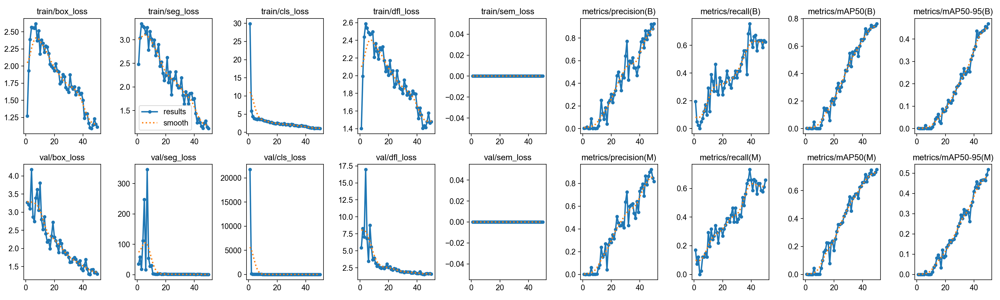
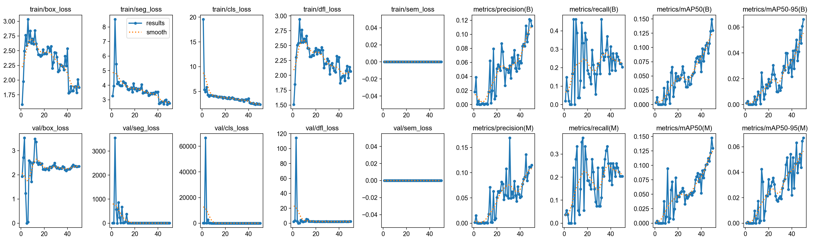
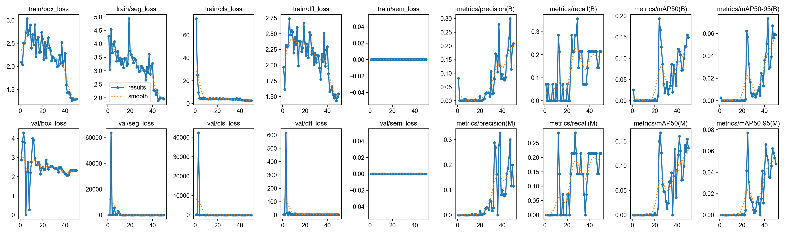
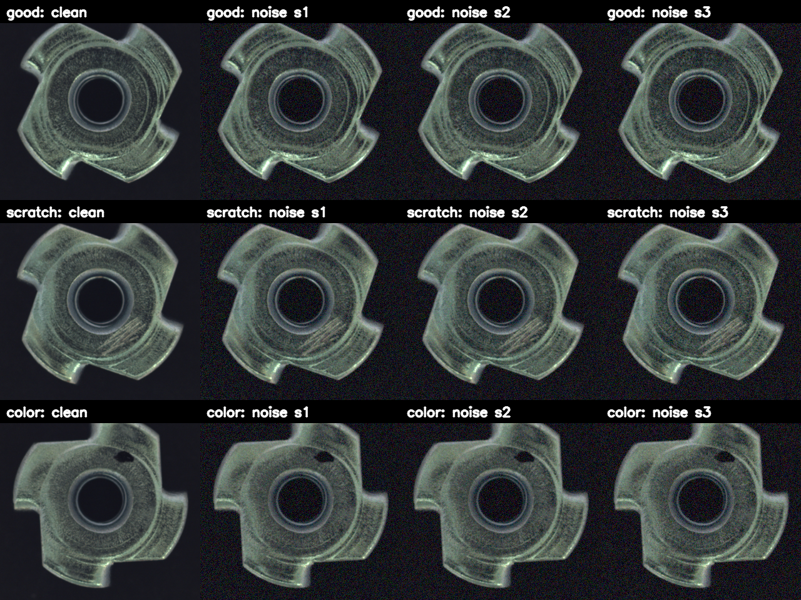
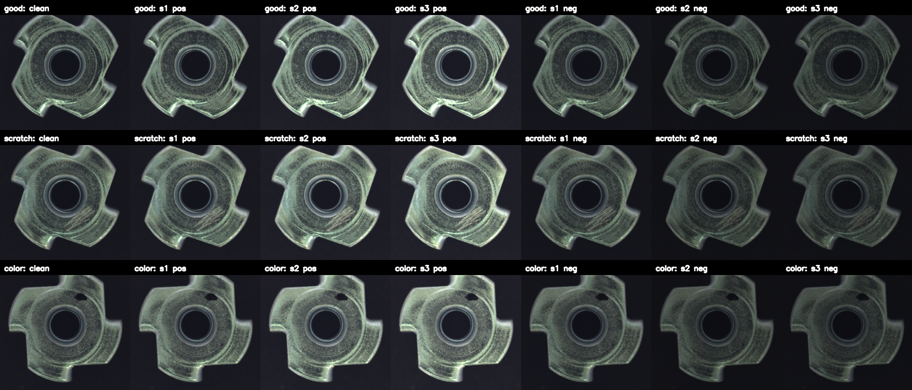
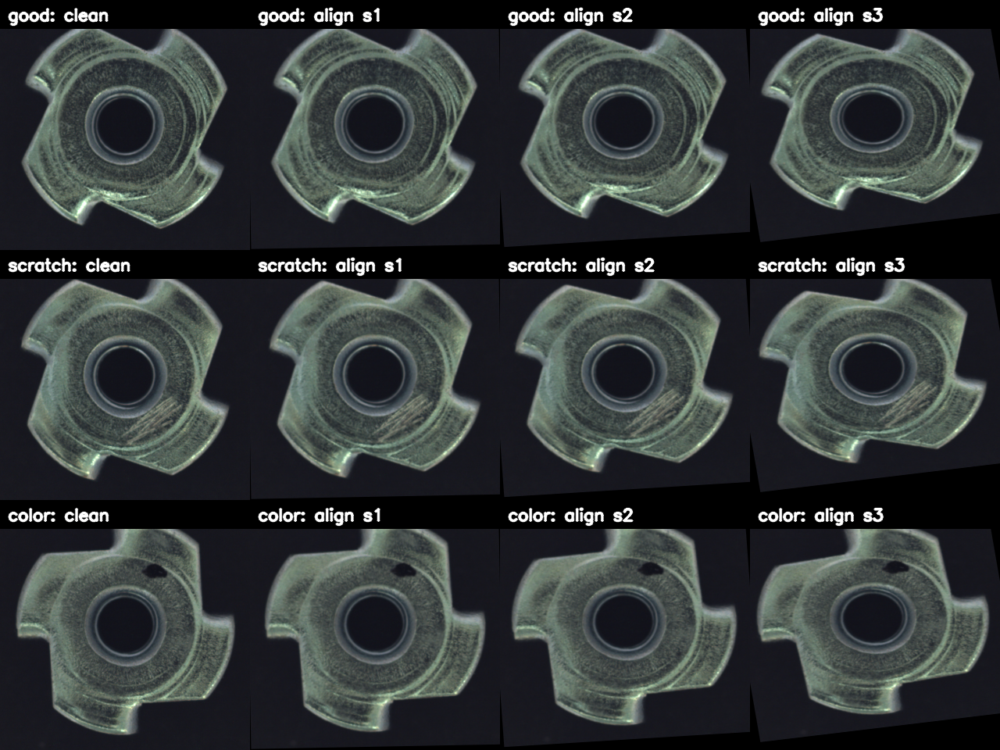
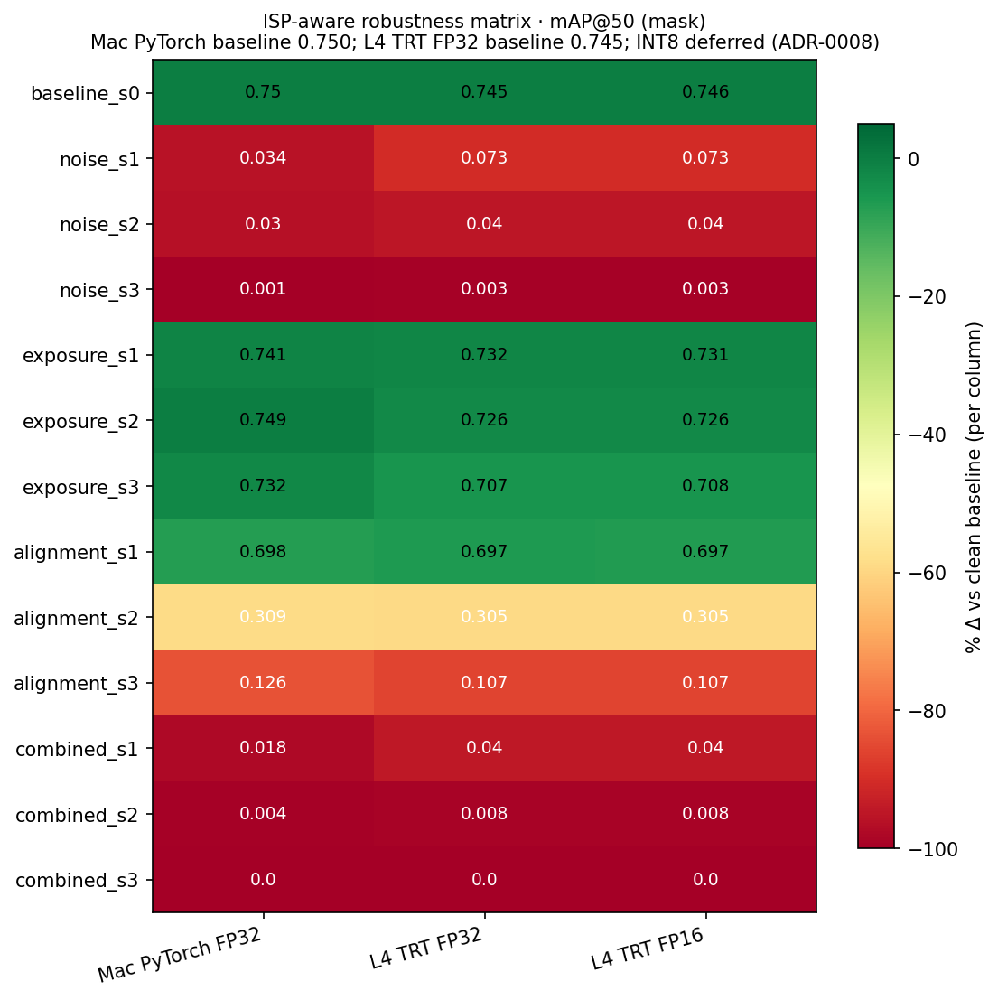
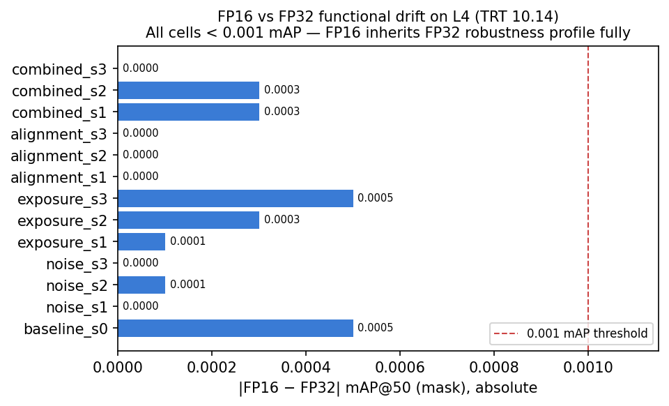

# Sprint Narrative — D1-D14 Walkthrough

Deep companion to [README](../README.md). Walks the full sprint stage by
stage with sub-items, figures, issues hit, workarounds, results, and
extension ideas. The README is recruiter-facing (90-sec read); this doc
is engineering-facing (deep-dive, cross-links to every artifact).

Conventions:

- ✅ done · 🟡 partial / deferred · ⏳ pending · ➖ dropped / N-A
- Frozen plan per stage: `docs/checklists/stage-{1..4}.md`
- Daily logs: `notes/day-NN.md`
- ADRs: `docs/adr/`

---

## Stage 1 — D1-D4: Repo Visible + Baseline

**Goal**: Repo pushable on D1 so the resume can reference it; baseline
trained + ONNX exported + TRT engines benchmarked by end of D4. Resume
submission unlocked from D1 onwards. Frozen plan:
[`docs/checklists/stage-1.md`](checklists/stage-1.md).

### D1 — Repo Skeleton ✅

- ✅ Repo `aoi-deepstream-tensorrt` created (private, MIT, GitHub Pages skill SSH host `github.com-hsuani`)
- ✅ `.gitignore` covers Python + data + engines + `__pycache__` etc; explicit `!docs/demo*.mp4` exemption for demo video
- ✅ `LICENSE` (MIT)
- ✅ `README.md` with scope + planned architecture + WIP badge
- ➖ Brev A10 NGC container path dropped; cloud GPU path migrated to Kaggle T4 (D4) + GCP L4 (D5-D7) — see D5 narrative

### D2 — MVTec Baseline (Mac MPS, $0) ✅

3 classes trained side-by-side; only metal_nut promotes to deployment.

- ✅ MVTec AD downloaded; 3 classes: transistor / cable / metal_nut
- ✅ `src/data/mvtec_to_yolo.py` — converter (user-written, not Claude-generated, per teach-mode rule)
- ✅ `src/data/visualize_yolo_label.py` — polygon overlay sanity check (`docs/yolo_overlay.png`, `docs/sample_check.png`)
- ✅ MPS sanity: `PYTORCH_ENABLE_MPS_FALLBACK=1`, batch=8, imgsz=640
- ✅ `src/train.py` — Ultralytics `YOLO('yolov8s-seg.pt').train(...)` device=mps
- ✅ Per-class metrics:

  | Class | mAP@50(M) | mAP@50-95(M) | Train time | Outcome |
  |---|---|---|---|---|
  | transistor | 0.167 | 0.077 | 26 min | failed (positional anomalies dominant) |
  | cable | 0.131 | 0.067 | 37 min | failed (4 defect types + positional) |
  | metal_nut | **0.750** | **0.518** | 36 min | strong ✅ |

  

  

  

- ✅ Hyperparameter ablation (transistor, 3 recipes):

  | Run | Recipe | mAP@50(M) | Lesson |
  |---|---|---|---|
  | v1 | lr=0.01, s, 640, full aug | 0.167 | baseline |
  | v2 | lr=0.001, n, 1024, no mixup/copy_paste | 0.0004 | copy_paste removal fatal |
  | v3 | lr=0.001, s, 640, full aug | 0.025 | lr=0.001 too conservative |

- ✅ Decision: `models/yolov8s_seg_metal_nut.pt` promotes to D3+ ([ADR-0003](adr/0003-metal-nut-as-primary-d3-model.md))

**Key insight**: supervised seg ceiling depends more on defect-type
composition (surface anomalies vs positional anomalies) than on sample
count. Cable had 2.3× more positives than transistor but similar mAP —
positional anomalies (missing_cable, missing_wire, cable_swap) need
classification, not segmentation. Full breakdown: [`notes/day-02-training_summary.md`](../notes/day-02-training_summary.md).

### D3 — ONNX Export ✅

- ✅ `src/export_onnx.py` — Ultralytics `.export(format='onnx', opset=17, dynamic=True, simplify=True)`
- ✅ `onnx.checker.check_model` passes
- ✅ onnxruntime CPU sanity: output shape `[1, 37, 8400]` + `[1, 32, 160, 160]` (det head + proto)
- ✅ `docs/onnx_graph.png` — Netron export
- ➖ EfficientAD secondary baseline dropped to stretch — D3 day-2 plan rationale: dataset is YOLO-friendly, EfficientAD adds AUC metric not used downstream

### D4 — TensorRT Build + Benchmark (Kaggle T4, $0) ✅

- ✅ Kaggle T4 notebook: [`notebooks/aoi-tensorrt-benchmark.ipynb`](../notebooks/aoi-tensorrt-benchmark.ipynb)
- ✅ `trtexec` build per precision (FP32 / FP16 / INT8)
- ✅ INT8 calibration: `IInt8EntropyCalibrator2` over 335 representative metal_nut images ([ADR-0004](adr/0004-entropy-calibration-over-minmax.md))
- ✅ Calibration cache: `engines/metal_nut_int8.cache` (14.86 KB) — model-domain bound, GPU-portable
- ✅ Latency benchmark: 50 warmup + 500 measured iterations, GPU event timing

**Headline numbers** (Kaggle T4, batch=1, imgsz=640):

| Precision | Engine size | Build time | Latency mean | Throughput | Speedup |
|---|---|---|---|---|---|
| FP32 | 58.0 MB | 57 s | 10.91 ms | 91.6 qps | 1.00× |
| FP16 | 25.3 MB | 319 s | 3.49 ms | 286.5 qps | **3.13×** |
| INT8 | 15.7 MB | 480 s | **2.09 ms** | **478.1 qps** | **5.22×** |

**Functional drift** (vs FP32 output0 mean): FP16 < 0.001%, INT8 8.62%. Per-precision mAP deferred to production-hardware verification (D9 / O1 — see below).

Full method: [`benchmarks/trt-t4.md`](../benchmarks/trt-t4.md) · daily log: [`notes/day-04-trt.md`](../notes/day-04-trt.md) · ADRs touched: 4, 5.

#### Issues + Workarounds (D4)

| Issue | Cause | Fix |
|---|---|---|
| `cv2.imread` failures on calibration tar | macOS AppleDouble `._*` files inflated image count 335 → 670 | glob filter `name.startswith("._")` skip |
| `set_calibration_profile` deprecated warnings (TRT 10.1) | PTQ path still functional; QAT migration deferred | accept warning, document; QAT = stretch |
| T4 INT8 throughput cap | Turing INT8 DP4A not at full Ampere scale | document hardware/precision coupling; promote L4 / A10 in D5+ |

#### Discussion

INT8 entropy calibration is engineering-heavy: own preprocessing match,
calibration-set composition, calibrator lifecycle (memory pre-alloc,
cursor pagination, cache I/O). The cache produced here is **portable
across GPU architectures** but bound to (training distribution, model
graph). This becomes the bridge to D8 ISP-aware augmentation: noise
augmentation at training time and entropy calibration at deployment time
should share the same physical noise model.

---

## Stage 2 — D5-D7: DeepStream Pipeline + Demo

**Goal**: End-to-end DeepStream 9.0 pipeline running INT8 TRT engine on
multi-stream input; 30-sec demo committed. Frozen plan:
[`docs/checklists/stage-2.md`](checklists/stage-2.md).

### D5 — DeepStream 9.0 on GCP L4 ✅

- ✅ GCP L4 VM (g2-standard-8, Spot, driver 590, Ubuntu 24.04)
- ✅ DS 9.0 container alive (`nvcr.io/nvidia/deepstream:9.0-samples-multiarch`, not the originally-planned `7.0-gc-triton-devel`)
- ✅ Sample app verified end-to-end
- ✅ `.pt` + `.onnx` + calibration cache uploaded to VM
- ✅ Migrated cloud path: Brev → Kaggle (D4) → GCP $300 trial (D5-D7); see `notes/day-05.md`

### D6 — Pipeline Scaffolding via `deepstream-byovm` Skill ✅

- ✅ Autonomous-mode `deepstream-byovm` skill generated end-to-end pipeline scaffolding
- ✅ Det-only path adopted ([ADR-0006](adr/0006-detection-only-deployment.md)); seg head reserved as offline reference
- ✅ Custom nvinfer bbox parser: `src/deepstream/models/yolov8s_seg_metal_nut/parser/`
- ✅ `config_infer_yolov8s_seg_metal_nut.txt` — det-only nvinfer config

#### Why det-only (ADR-0006)

YOLOv8-seg outputs det head `[1, 37, 8400]` + proto `[1, 32, 160, 160]`.
Full instance-mask recovery in DeepStream requires a custom
`NvDsInferParseCustomInstanceMaskFunc` doing sigmoid(proto · coef) +
bbox-crop in C++. Within the 2-week budget, det-only ships the pipeline
correctness story; mask recovery is Path B stretch (`notes/day-07-plan.md` §7g).

### D7 — Multi-Stream Bench + Demo ✅

- ✅ TRT engine rebuilt **in DS 9.0 container on L4** — calibration cache (D4 T4 origin) reused as-is; ~5-15 min re-calibration cost skipped
- ✅ Multi-stream config `ds_app_4stream.txt`: 4 streams × `.mp4` loops (120 s each, 15 fps, 1280×720, libx264)
- ✅ 2 runs × `**PERF` samples captured
- ✅ `reports/benchmark_report.{md,html,pdf}` + 5 charts generated by skill `generate_report.py`
- ✅ KITTI dump: 9876 metal_nut defect detections across 4-stream × ~10 s window (parser correctness sanity)
- ✅ Demo video produced **Mac-side** (115 metal_nut test images → Ultralytics MPS + ffmpeg → 28-sec h264 mp4 + palettized GIF)

**Headline numbers** (GCP L4 INT8, batch=4 = num_streams):

| Run | fps / stream | total img/s | RT @ 30 fps |
|---|---|---|---|
| 1 | 116.17 | 464.68 | ✅ 3.8× headroom |
| 2 | 116.43 | 465.72 | ✅ |

| trtexec | throughput | latency mean |
|---|---|---|
| BS=1 | 540 qps | 1.78 ms |
| BS=4 | 808 img/s | 4.80 ms / batch |

L4 vs T4 INT8 BS=1: 478 → 540 qps (**1.13× speedup**). DeepStream pipeline
absorbs ~57% of raw trtexec throughput (808 → 465) to decode + memcpy +
nvinfer + osd + sink — within typical DS production envelope.

> 28-sec clip showing per-frame defect detection. Mac-rendered for portfolio
> embedding; production DS pipeline produces visually equivalent overlays at
> sub-2 ms latency on L4.
>
> [Full HD mp4](deepstream_demo.mp4) · [PDF benchmark report](../src/deepstream/models/yolov8s_seg_metal_nut/reports/benchmark_report_yolov8s_seg_metal_nut.pdf)

#### Issues + Workarounds (D5-D7)

| # | Issue | Cause | Fix |
|---|---|---|---|
| 1 | `cuda_runtime_api.h` not found | DS9 ships CUDA 13.1 (not 12.8 as in nvinfer Makefile); runtime image lacks dev headers | apt `cuda-cudart-dev-13-1` etc; base image `samples-multiarch`; Makefile `/usr/local/cuda` symlink |
| 2 | `pip3 install` "externally-managed-environment" | Ubuntu 24.04 PEP 668 system Python lock | `--break-system-packages` (acceptable in container, not host) |
| 3 | DS pipeline EOS at 3 sec | theora encoder produced broken 3-sec mp4; container lacks `x264enc` / `openh264enc` / `/dev/v4l2-nvenc` | Mac-side ffmpeg + libx264 generates 120 s test loops; scp into VM |
| 4 | `[source*] file-loop=1` warn | Invalid key for DS 9.0 | remove key; rely on long source video |
| 5 | `gcloud compute ssh` 4003 backend failed | VM has no external IP; missing IAP firewall rule | add `allow-iap-ssh` rule, source `35.235.240.0/20`, tcp:22 |
| 6 | GCP VM Spot reclaim | Spot scheduling | cold restart; consider STANDARD if timing-sensitive |
| 7 | DS base image `9.0-gc-triton-devel` deprecated | NV moved to `samples-multiarch` for DS9 | patch base image in Dockerfile |

Daily logs: [`notes/day-05.md`](../notes/day-05.md), [`notes/day-06.md`](../notes/day-06.md), [`notes/day-07.md`](../notes/day-07.md), pre-execution plan: [`notes/day-07-plan.md`](../notes/day-07-plan.md).

#### Discussion

The skill-orchestration path (`deepstream-byovm` autonomous mode) cut D6
from ~2 days to ~0.5 day. ADR-0006 documents the trade: det-only ships
on schedule; mask-recovery Path B is deferred but well-scoped if a
reviewer asks. The 57% DS overhead (808 raw → 465 aggregate) is the real
production number — it's what a customer would see, not the raw trtexec
benchmark.

#### D7 → D8 Bridge

GCP teardown done at end of D7 (snapshot `aoi-d5-d7-final` retained,
boot disk deleted, instance deleted, IAP firewall rule kept free) to
stop billing during D8-D9 Mac-side work. D9 O1 (cross-precision
robustness) plans to re-spin VM from snapshot. See [`notes/day-07.md` §Pre-D8 GCP Teardown](../notes/day-07.md).

---

## Stage 3 — D8-D10: ISP-aware Differentiation + Polish

**Goal**: Convert prior ISP background into a measurable, defensible
robustness study. This is the differentiator no other AOI repo has.
Frozen plan: [`docs/checklists/stage-3.md`](checklists/stage-3.md).

### D8 — ISP-aware Augmentation Modules ✅

Three perturbation modules, all linear-domain physics (de-gamma → perturb → re-gamma).

#### D8 sub-items

- ✅ `src/isp_aug/noise.py` — Poisson shot + Gaussian read + ISO/gain push + per-channel σ asymmetry (Bayer-pattern sim)

  Tune round 1 (post-visual-sanity): initial s1 `(shot=1000, read=0.005, gain=1.0)` mapped to "lab-golden" (SNR > 50 dB) — visually indistinguishable from clean baseline → wasted a measurement cell. Re-tuned to **`(shot=400, read=0.010, gain=1.0)`** = "production-line normal" (SNR 30-40 dB, LED 1-6 mo aged + thermal drift). s1 → s2 → s3 now tracks degrading operational reality, not "lab → industrial" jump. Full table: [`notes/day-08.md` §4 tuning round 1](../notes/day-08.md).

  

- ✅ `src/isp_aug/exposure.py` — linear gain (EV) + WB temperature shift (R/B per-channel) + gamma curve offset

  Severity range: ±0.5 EV / ±200K (s1) → ±2.0 EV / ±1000K (s3). Pos/neg drift seeds supported.

  

- ✅ `src/isp_aug/alignment.py` — rotation (±deg) + translation (±px) + anisotropic scale (sx ≠ sy)

  s1 ±2° / ±3 px / ±2% inside training-aug range (sanity baseline); s3 ±15° / ±25 px / ±15% camera misalignment scenario. Border mode `cv2.BORDER_CONSTANT, value=0` — metal_nut's near-black background avoids fake-edge artifacts.

  

- ✅ `src/isp_aug/apply_perturbation.py` — CLI driver; generates 12 perturbed val cells (3 perturbations × 3 severities + 3 combined)
- ✅ Combined-apply uses ISP-realistic ordering: `alignment → exposure → noise` (workpiece pose → lens → sensor)
- ✅ Pre-D9 hypotheses captured before any eval ([ADR-0007](adr/0007-isp-aware-perturbation-hypotheses.md))

#### D8 sub-discussion

- **Why linear-domain physics?** sRGB-domain "GaussianBlur" + brightness shift produce visually wrong results: noise gets gamma-compressed; exposure shift compounds with sensor non-linearity. The de-gamma → perturb → re-gamma pipeline matches real ISP behaviour and makes noise calibration physically grounded.
- **Why `noise` >>> `exposure` predicted?** Training augmentation included `hsv_h/s/v` (sRGB brightness/saturation jitter) but **zero sensor-noise model**. So exposure has partial training-time coverage; noise is fully OOD.
- **Why production-line normal (s1) not lab-golden?** s1 should be the operational baseline a deployed model would see, not a best-case lab condition. Wasting a measurement cell on lab-golden has no discriminative information.

### D9 — Robustness Eval Matrix 🟡

D9 execution narrative: [`notes/day-09.md`](../notes/day-09.md). Full
analysis: [`benchmarks/robustness.md`](../benchmarks/robustness.md).

#### D9 sub-items

- ✅ Aggregate mAP@50 (mask) matrix — 13 cells (1 baseline + 9 individual + 3 combined), Mac PyTorch FP32
- ✅ Per-defect-type breakdown (52 sub-evals via filename-prefix filter)
- ✅ Hypothesis verdicts (H1-H4 vs ADR-0007)
- ✅ Visual proof grids (`docs/robustness_grid_moderate.png`, `_severity.png`)
- ✅ **Cross-precision FP32 + FP16 matrix on L4** (TRT 10.14, 2026-05-12) — H2 FP16-half answered: max drift 0.0005 mAP, FP16 ≡ FP32 functionally. Snapshot `aoi-d9-cross-precision` retained for future H3/H4 follow-up. Results: [`benchmarks/robustness_cross_precision.csv`](../benchmarks/robustness_cross_precision.csv) + [`benchmarks/l4_logs/`](../benchmarks/l4_logs/).
- 🟡 **INT8 deferred** — TRT 10.14 tactic gap for YOLOv8-seg proto Conv+Sigmoid+Mul fusion blocks entropy-calibration build on L4 (DS 9.0 container). Scoped + documented in [ADR-0008](adr/0008-trt-10-14-int8-tactic-gap-yolov8seg.md). H2 INT8 half stays open pending TRT future-version tactic coverage or QAT migration.
- ✅ **Aggregated heatmap PNG** `benchmarks/robustness_plot.png` + companion `benchmarks/robustness_drift_plot.png` (FP16 vs FP32 abs drift bar chart). Generator: `scripts/gen_robustness_heatmap.py`.
- ✅ **Bonus finding — Mac PyTorch vs L4 TRT-engine post-process drift**: noise_s1 mAP 0.034 (Mac) vs 0.073 (L4 TRT), 2× higher despite clean baseline drift < 1%. Likely NMS / interp / proto-mask precision differences in engine post-process. Bisect deferred as sub-study.
- ⏳ Label-transform-aware alignment cells — current cells conflate model-robustness with label-image misalignment
- ⏳ Noise-augmented retrain experiment — proposed mitigation not yet demonstrated
- ✅ `notes/day-09.md` (this rewrite — was previously folded into `notes/day-08.md` §9)

#### D9 results

Baseline mAP@50 (mask) = **0.7502** on metal_nut val.

| Perturbation | s1 | s2 | s3 |
|---|---|---|---|
| noise | 0.034 (-95%) | 0.030 | 0.001 (-99.8%) |
| exposure | 0.741 (-1%) | 0.749 | 0.733 (-2%) |
| alignment | 0.698 (-7%) | 0.309 | 0.126 (-83%) |
| combined | 0.018 | 0.005 | 0.000 |

Empirical sensitivity ranking: **NOISE >>> ALIGNMENT > EXPOSURE**
(predicted in ADR-0007: NOISE > EXPOSURE > ALIGNMENT — partially wrong).

#### D9 hypothesis verdicts

| # | Hypothesis | Verdict | Notes |
|---|---|---|---|
| H1 | NOISE > EXPOSURE > ALIGNMENT | **PARTIALLY WRONG** | direction kept on NOISE first; exposure / alignment swapped; magnitude wildly underestimated |
| H2 | INT8 compounds noise disproportionately | **HALF-ANSWERED** | FP16 ≡ FP32 verified on L4 (max drift 0.0005 mAP); INT8 deferred per [ADR-0008](adr/0008-trt-10-14-int8-tactic-gap-yolov8seg.md) |
| H3 | Mild alignment within training-aug envelope (< 5%) | **CORRECT (within tolerance)** | 7.0% drop, just above predicted bound |
| H4 | Combined-apply super-linear | **INCONCLUSIVE** | masked by noise dominance |

#### D9 cross-precision matrix (L4 TRT 10.14)

Two findings beyond the FP32 Mac results:

- **FP16 ≡ FP32 functionally** — H2 FP16-half answer. Max abs drift
  0.0005 mAP@50; production-relevant cells < 0.0001. Promotes FP16 from
  "production precision via D4 latency" to "production precision via D9
  robustness parity verified" (reinforces [ADR-0005](adr/0005-fp16-as-production-precision.md)).
- **Mac PyTorch vs L4 TRT-engine drift** — clean baseline diff < 1%
  (engine-path tolerance), but noise_s1 cell shows 2× higher mAP on the
  L4 TRT path (0.073) vs Mac PyTorch (0.034). Likely NMS implementation,
  letterbox interpolation, or proto-mask numerical precision in the
  engine post-process. Deployment-realistic number is L4 TRT; Mac path
  is a *lower-bound* fast iteration surface. Bisect sub-study deferred.

INT8 verdict deferred — see [ADR-0008](adr/0008-trt-10-14-int8-tactic-gap-yolov8seg.md):
TRT 10.14 lacks tactic for YOLOv8-seg proto Conv+Sigmoid+Mul fusion under
entropy calibration. Path forward = wait for TRT future-version coverage
or migrate to QAT.

> 5 sample × 5 cell at moderate severity (s2). Clean detects defects
> cleanly; noise / combined produce "blue-blob" oversized masks (high
> false-positive area); exposure preserves detection; alignment partial.

[Severity progression on `scratch_007`](robustness_grid_severity.png) — 4×4 grid noise/exposure/alignment/combined × clean/s1/s2/s3.

#### D9 per-defect insights

- **flip is alignment-invariant** (0.995 across all alignment severities) — model learned rotation-equivariant features for the orientation-anomaly defect class
- **color baseline is the bottleneck** (0.396 on clean) — subtle tonal anomalies are fundamentally harder than geometric defects; aggregate 0.75 dragged down primarily by color
- **color slightly improves under exposure** (s2 0.401 / s3 0.404 > clean 0.396) — gain push enhances tonal contrast, the dominant cue
- **scratch + noise = catastrophic** (0.712 → 0.128 at noise_s1) — scratch's high-frequency cue drowns under additive Poisson + Gaussian
- **bent has an alignment cliff at s2** (0.995 → 0.095) — combined rotation + translation + anisotropic scale disrupts edge-angle cue

#### D9 key engineering insight (portfolio gold)

> Production-line normal noise (SNR 30-40 dB) drops mAP from 0.75 to 0.03 (-95%).
> Training had zero sensor-noise augmentation — any noise input is fully OOD.

**Mitigation path** (NV-flavored): integrate `noise.apply()` (same
linear-domain Poisson + Gaussian model used for D4 INT8 calibration) as
a training-time augmentation transform. Calibration cache (D4) and
training noise model (D8) share one physics, bridging quantization
design with deployment robustness — the genuine ISP-engineering bridge
story for industrial AOI.

### D10 — README v2 + Repo Polish 🟡

- ✅ README updated with D7 multi-stream + D8 robustness sections
- ✅ Architecture diagram includes ISP aug branch (this doc + `docs/architecture.{dot,png}`)
- 🟡 Type hints + docstrings audit — partial across `src/isp_aug/`
- ⏳ `Makefile` / `justfile` targets (`train`, `export`, `engine`, `pipeline`, `bench`, `bench-robust`)
- 🟡 `requirements.txt` pinned versions — minimum-version pinning, not `==` exact
- ✅ `LICENSE` (MIT)
- ⏳ Optional GitHub Actions CI lint + smoke test

---

## Stage 4 — D11-D14: Marketing + Submit ⏳

**Goal**: Convert repo into interview pipeline. Mostly text + forms,
no GPU. Frozen plan:
[`docs/checklists/stage-4.md`](checklists/stage-4.md).

- ⏳ D11 — Blog draft "From Smartphone ISP to Factory AOI"
- ⏳ D12 — NVIDIA Inception application + portfolio site update + LinkedIn Skills row
- ⏳ D13 — Repo flip private → public + LinkedIn launch post + blog publish
- ⏳ D14 — Resume v13 + cover letter v8 + Metropolis (Manufacturing) submission + InMails to 3 NV Taiwan contacts

---

## Extensions / Open Questions

Ordered by NV-Metropolis fit + portfolio impact.

1. **INT8 robustness eval** — gated by TRT future-version tactic coverage for the YOLOv8-seg proto Conv+Sigmoid+Mul fusion, or by migrating from PTQ entropy calibration to QAT with explicit Q/DQ nodes. Either path completes the H2 verdict. Snapshot `aoi-d9-cross-precision` retained (~$5/mo idle) to re-spin the same L4 config when TRT 11.x / 12.x lands. See [ADR-0008](adr/0008-trt-10-14-int8-tactic-gap-yolov8seg.md).
2. **Noise-augmented retrain** (D9 O4) — converts §3a mitigation from "proposed" to "demonstrated"; ideally closes 0.75 → 0.03 gap; would be the headline blog-post number. Reuses `src/isp_aug/noise.apply` as an Ultralytics custom transform (D2 v4 recipe).
3. **Mac PyTorch vs L4 TRT-engine post-process drift bisect** — identify whether NMS implementation, letterbox interpolation, or proto-mask numerical precision dominates the 2× noise_s1 gap. Practical relevance: how much do offline iteration-loop numbers under-predict deployed robustness?
4. **Label-transform-aware alignment cells** (D9 O3) — separates "model robustness" from "label-image misalignment". Adds `--transform-labels` flag to `apply_perturbation.py`; reruns alignment + combined cells with affine matrix applied to ground-truth polygons.
5. **Path B: custom YOLOv8-seg parser** ([`notes/day-07-plan.md` §7g](../notes/day-07-plan.md)) — recovers instance masks at runtime in DS pipeline; demo video v2 with polygon overlay generated by DS itself.
6. **EfficientAD secondary baseline** — image-level AUC for the "good-only training" regime; complements supervised seg story with the unsupervised-anomaly-detection angle.
7. **Jetson Orin Nano deployment** — edge-device variant of the same engine; demonstrates portability across NV inference hardware tiers (T4 → L4 → Orin).
8. **Cable / transistor robustness via the same ISP aug** — lower-baseline classes may show interesting degradation patterns (mentioned in [`day-02-training_summary.md`](../notes/day-02-training_summary.md) but not yet executed).
9. **Multi-model cascaded inference** (PGIE + SGIE) — current pipeline is single-model; production AOI lines often use detect-then-classify (e.g. defect localiser + defect-type classifier head).
