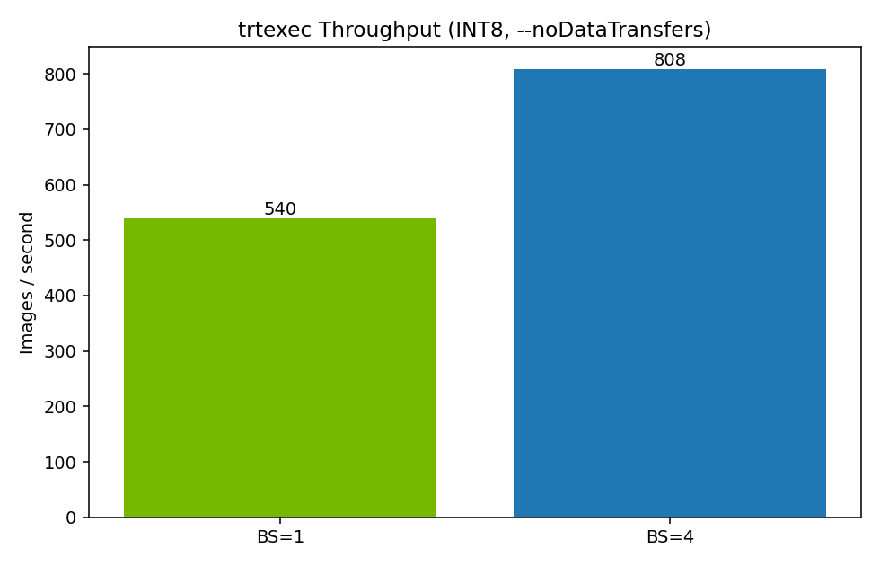
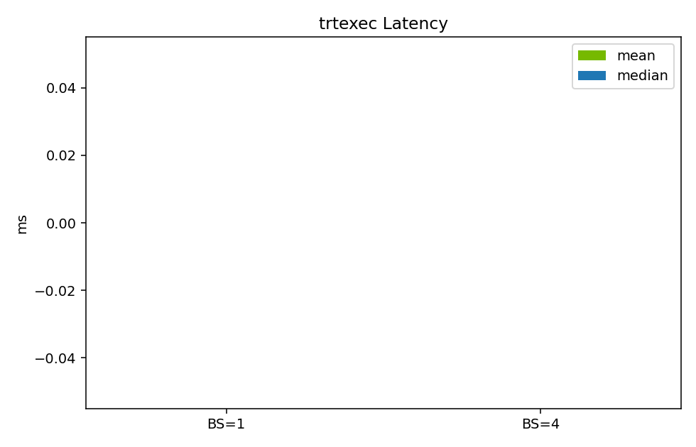
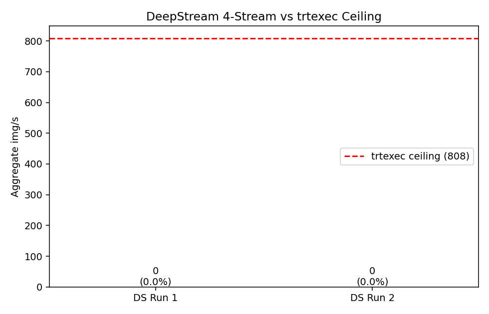
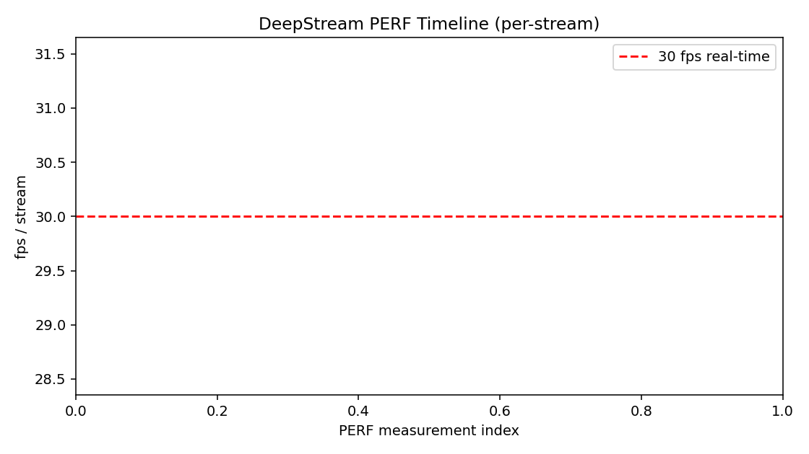
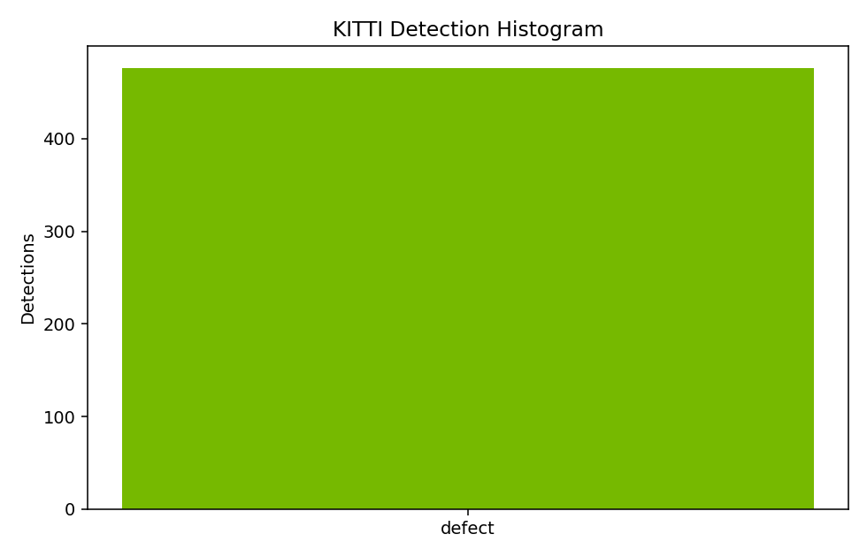

# Benchmark Report: yolov8s_seg_metal_nut

## 1. Model
- ONNX: `model/yolov8s_seg_metal_nut.onnx`
- Architecture: YOLOv8-seg (single class, det-only at runtime)
- Input: `images` [1,3,640,640], BGR->RGB, /255
- Outputs (engine binds both, parser reads only `output0`):
  - `output0` [1,37,8400] = 4 bbox + 1 cls + 32 mask coef
  - `output1` [1,32,160,160] = prototype masks (UNUSED)

## 2. Hardware
- Target: GCP VM `aoi-d5` (us-central1-a), L4 GPU
- DeepStream 9.0 container

## 3. Engine Build
- Precision: INT8 (`metal_nut_int8.cache`)
- Dynamic batch [1..4]
- Engine: `benchmarks/engines/yolov8s_seg_metal_nut_dynamic_b4.engine`

## 4. trtexec BS=1
- Throughput: 539.81 qps
- Latency mean / median: 0.00 / 0.00 ms

## 5. trtexec BS=4
- Throughput: 201.99 batches/s = 807.95 img/s
- Latency mean / median: 0.00 / 0.00 ms

## 6. DeepStream Multi-Stream (batch=4, 4 streams)
| Run | Streams | fps/stream | total img/s | DS efficiency |
|-----|---------|------------|-------------|---------------|
| Run 1 | 4 | 0.00 | 0.00 | 0.0% |
| Run 2 | 4 | 0.00 | 0.00 | 0.0% |

Real-time @ 30 fps/stream: **NO**

## 7. Detection Sanity (KITTI dump)

## 8. Pipeline Stages
1. Engine build (`scripts/build_engine.sh`)
2. Loop sources (`scripts/prep_test_loops.sh`)
3. Single-stream mock factory (`scripts/run_pyservicemaker_mock_factory.py`)
4. Multi-stream bench (`scripts/bench_multistream.sh`)
5. Report (this script)

## 9. Parser Notes
- Det-only: 32 mask coefficients in `output0` channels 5..36 are skipped.
- `output1` (prototype masks) bound but not consumed.
- `cluster-mode=2` (DS NMS), `pre-cluster-threshold=0.25`.

## 10. Known Limitations
- No mask metadata produced; instance segmentation requires `network-type=3` plus a sigmoid+matmul postprocess that this skill does not cover.
- INT8 calibration cache reused as-is; rebuild if class distribution shifts.

## 11. Encoder Mode
- Primary: `nvv4l2h264enc` -> `.mp4`
- Fallback: `theoraenc + oggmux` -> `.ogv`

## 12. Files
- Engine: `benchmarks/engines/yolov8s_seg_metal_nut_dynamic_b4.engine`
- Logs: `benchmarks/b1/trtexec_b1.log`, `benchmarks/b4/trtexec_b4.log`,
  `benchmarks/ds/ds_s4_run1.log`, `benchmarks/ds/ds_s4_run2.log`
- Sample video: `samples/metal_nut_mock.{mp4,ogv}`
